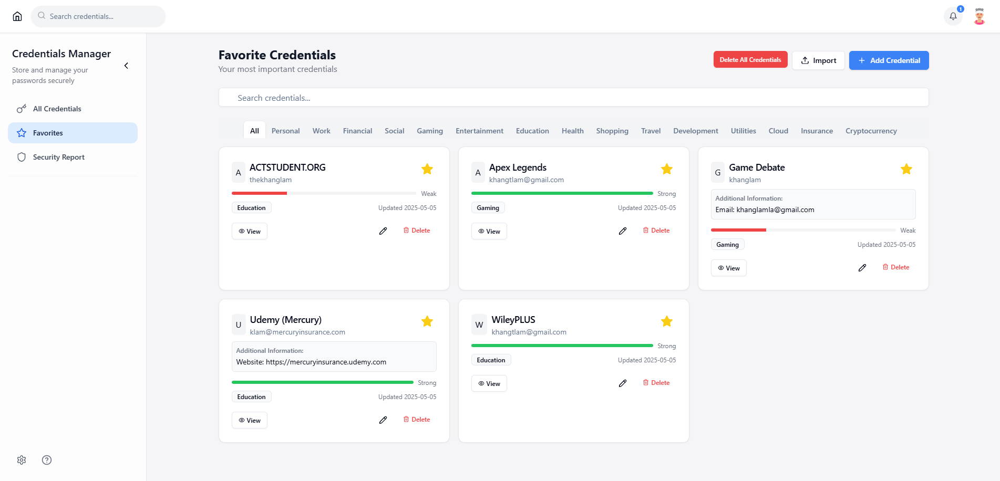

<h1 align="center">
  🔐 <a href="https://credentialsmanager.up.railway.app/" target="_blank" rel="noopener noreferrer">Credentials Manager</a>
</h1>

<p align="center">
  <b>Modern. Secure. Effortless credential management for the next generation.</b><br>
</p>

<p align="center">
  
  
  
  
</p>

---

## 🚀 Why Credentials Manager?

Within Chrome, sure we have Google Password Manager, but for passwords outside of Chrome, I'm tired of tracking my passwords via txt/excels files. This was an issue for myself, friends and family, which was enough for me to build this app.

Credentials Manager is a full-stack, production-grade password manager designed for users who demand both **security** and **delightful UX**. Built with React, Supabase, and modern UI libraries, it empowers you to securely store, organize, and access credentials—anywhere, anytime.

This app was made for me, so I understand the struggles to migrate from txt/excels files. There's a feature that allows you to easily import your credentials files to the app.

**Note:** ALL credentials stored are encrypted and protected where even I can't access them.

---

## ✨ Key Features

- **🔒 Secure Authentication** — Supabase-powered sign-up, login, and session management
- **🔑 Password Recovery** — "Forgot password" and change password flows
- **🗂️ Credential Management** — Add, edit, delete, and categorize credentials
- **⭐ Favorites & Quick Access** — Pin your most-used logins
- **🔍 Fast Search & Filtering** — Instantly find credentials by name, username, or notes
- **🛡️ Security Report** — Visualize password strength and detect reuse
- **📱 Mobile-First Design** — Responsive, app-like experience on any device
- **⚡ Modern UI** — Built with Radix UI, Lucide icons, and Tailwind CSS
- **📥 Import/Export** — Backup or migrate credentials easily

<p align="center">
  
</p>

---

## 🛠️ Tech Stack

- **Frontend:** React, Vite, TypeScript, Radix UI, Lucide Icons
- **Backend:** Supabase (Auth & Database)
- **Styling:** Tailwind CSS

---

## 🏁 Getting Started (if you want to contribute)

1. **Clone the repository**
   ```bash
   git clone https://github.com/yourusername/CredentialsManager.git
   cd CredentialsManager
   ```
2. **Install dependencies**
   ```bash
   npm install
   ```
3. **Configure environment**
   - Create your own `.env` file and fill it with your Supabase credentials
   - Only need `VITE_SUPABASE_URL` and `VITE_SUPABASE_ANON_KEY`
4. **Run the app**
   ```bash
   npm run dev
   # Visit http://localhost:5173
   ```

---

## 📂 Project Structure

```
src/
  components/
    auth/             # Authentication forms and logic
    credential/       # Credential CRUD components
    dashboard/        # Layout, sidebar, top navigation
    pages/            # Main pages (credential manager, settings, etc.)
  supabase/           # Supabase client and auth context
  lib/                # Utility functions (e.g., password strength)
  App.tsx             # App routes
  main.tsx            # App entry point
```

---

## 🔐 Security

- Passwords are never stored in plaintext.
- All sensitive operations require authentication.
- **Planned:** End-to-end encryption, biometric unlock, breach monitoring.

---

## 🗺️ Planned Features & Improvements

- [x] **End-to-End Encryption** (client-side)
- [ ] **Biometric Authentication**
- [x] **Strong Password Generator**
- [ ] **Browser Extension** for autofill
- [ ] **Secure Sharing & Audit Log**
- [ ] **Cloud Backup & Bulk Editing**
- [x] **Advanced Search & Filtering**
- [ ] **Dark Mode & Theme Customization**
- [ ] **Multi-language Support**

---

## 🤝 Contributing

Pull requests are welcome! For major changes, please open an issue first to discuss your ideas.

---

## 📄 License

[MIT](LICENSE)

---

<p align="center">
  <i>Built for security, designed for delight.</i>
</p>

<!--
Screenshots:
- Place your app screenshots in ./assets/ and update the image links above.
- Example: 
-->
